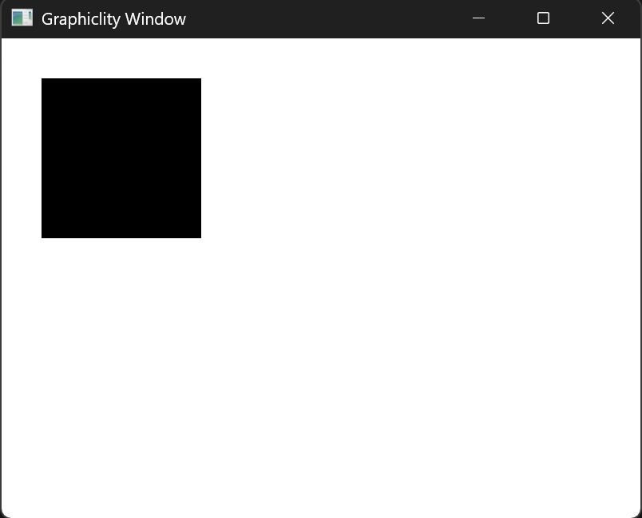
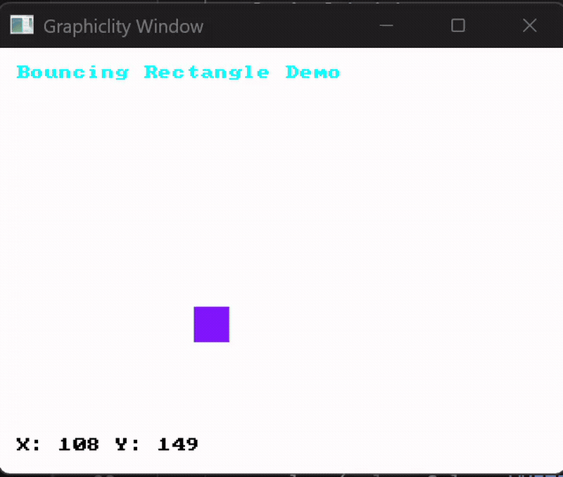

# Graphicility: A Minimal Graphics Library

**Graphicility** (pronounced "Grah-fih-kill-ih-tee") is a minimal graphics library that makes drawing pixels, shapes, and text to a window dead simple - in Rust.

If you've ever tried to draw something to a window in Rust for a CHIP-8 emulator or a small tool, you know the pain. `iced` and `egui` feel like overkill. `wgpu` + `winit` feels far too low-level.

**_Graphicility_ exists to bridge that gap.**

It provides a small, immediate-mode drawing API on top of a window and render loop without forcing a UI framework or a specific architecture on you.

---

## Graphicility is NOT

- A UI framework
- A widget or layout system
- A game engine
- A replacement for `iced`, `egui`, or `wgpu`

If you need those things, Graphicility is probably not the right tool - and that's okay.

---

## Features

- ✅ Primitives: pixels, lines, rectangles, circles, triangles
- ✅ RGBA color support with alpha blending
- ✅ Built-in 8×8 bitmap font for text rendering
- ✅ Raw pixel buffer access for full control
- ✅ Keyboard and mouse input handling
- ✅ Automatic DPI scaling
- ✅ Fixed logical resolution (perfect for pixel-art and emulators)
- ✅ Resizable windows with aspect ratio preservation
- ✅ Zero-setup: just call `run()` and start drawing

---

## Installation

Add this to your `Cargo.toml`:

```toml
[dependencies]
graphicility = "0.4"
```

---

## Examples

### Basic Drawing

```rust
use graphicility::{run, Color};

fn main() {
    run(|ctx| {
        let g = ctx.graphics();
        g.clear(Color::WHITE);
        g.rect((50, 50), (100, 100), Color::BLACK);
    });
}
```



---

### Shapes Demo

```rust
use graphicility::{Color, Config};

fn main() {
    let conf = Config::builder().with_title("Geometry").build();

    graphicility::run_with(conf, |ctx| {
        let g = ctx.graphics();
        g.clear(Color::rgb(30, 30, 45));

        // Lines
        g.line((320, 0), (320, 400), Color::rgba(255, 255, 255, 20));
        g.line((0, 200), (640, 200), Color::rgba(255, 255, 255, 20));

        // Rectangle
        g.rect((135, 260), (50, 50), Color::CYAN);

        // Target pattern using circles
        let center = (160, 100);
        g.circle(center, 40, Color::RED);
        g.circle(center, 30, Color::WHITE);
        g.circle(center, 20, Color::RED);
        g.circle(center, 10, Color::WHITE);

        // Triangles
        g.triangle((475, 50), (525, 120), (425, 120), Color::YELLOW);
        g.triangle((425, 250), (525, 310), (425, 310), Color::GREEN);

        g.text((220, 10), "Graphicility Shapes Demo", Color::WHITE);
    });
}
```

---

### Bouncing Rectangle

```rust
use graphicility::{Color, Config};

struct Vec2 { x: i32, y: i32 }

fn main() {
    let mut pos = Vec2 { x: 50, y: 50 };
    let mut vel = Vec2 { x: 2, y: 3 };
    let size = Vec2 { x: 20, y: 20 };

    let conf = Config::builder().with_title("Bouncing Rect").build();

    graphicility::run_with(conf, move |ctx| {
        let dt = ctx.delta_time();
        let g = ctx.graphics();

        pos.x += (vel.x as f64 * dt * 60.0) as i32;
        pos.y += (vel.y as f64 * dt * 60.0) as i32;

        let (width, height) = g.logical_size();

        if pos.x <= 0 || pos.x + size.x >= width as i32 { vel.x = -vel.x; }
        if pos.y <= 0 || pos.y + size.y >= height as i32 { vel.y = -vel.y; }

        g.clear(Color::WHITE);
        g.rect((pos.x, pos.y), (size.x, size.y), Color::rgb(128, 23, 255));
        g.text((10, 10), "Bouncing Rectangle Demo", Color::CYAN);
        g.text((10, height as i32 - 20), format!("X: {} Y: {}", pos.x, pos.y), Color::BLACK);
    });
}
```



---

### Mouse Drawing (Brush)

```rust
use graphicility::{Color, KeyCode, MouseButton};

fn main() {
    let mut points: Vec<Option<(i32, i32)>> = vec![];

    graphicility::run(move |ctx| {
        let (g, input) = ctx.split();

        g.clear(Color::rgb(20, 20, 20));

        if input.mouse_down(MouseButton::Left) {
            if let Some((mx, my)) = input.mouse_pos() {
                points.push(Some((mx as i32, my as i32)));
            }
        }

        if input.mouse_released(MouseButton::Left) {
            points.push(None);
        }

        if input.key_down(KeyCode::Space) {
            points.clear();
        }

        for pair in points.windows(2) {
            if let (Some(a), Some(b)) = (pair[0], pair[1]) {
                g.line(a, b, Color::YELLOW);
            }
        }

        g.text((10, 10), "Left Click to Draw - Space to Clear", Color::WHITE);
    })
    .unwrap();
}
```

---

## When to use Graphicility?

| Use Case | Fit |
|---|---|
| Retro emulator (CHIP-8, Game Boy, etc.) | ✅ Perfect |
| Embedded display simulator (SH1106, SSD1306) | ✅ Perfect |
| Small Rust tool that needs basic graphical output | ✅ Perfect |
| Building a UI framework on top of Graphicility | ✅ See [Developing Extensions](./DEVELOPING_EXTENSIONS.md) |
| Full-featured game or desktop application | ❌ You'll be fighting the library |

---

## How it works

Internally, Graphicility handles:

- Window creation and the event loop
- A render loop with delta time
- DPI scaling and logical resolution
- Pixel drawing to the framebuffer

You control **what** is drawn. Graphicility handles **how** it appears on screen.

---

## Philosophy

Graphicility is designed to be the **first mile** of graphics in Rust.

It favors:

- Explicit code over magic
- Simplicity over complexity
- Approachability over completeness

Drawing a circle should not require hundreds of lines of boilerplate.

---

## Limitations

- **No low-level renderer access**: Graphicility intentionally hides internals to stay simple
- **No audio**: Graphics only
- **Single window**: One window per application

---

## Status

Graphicility is currently under active development. APIs may change as the library matures through real-world use.

---

## Contributing

All kinds of contributions are welcome - from extending features to swapping out the core renderer. Check out [CONTRIBUTING.md](./CONTRIBUTING.md) to get started.